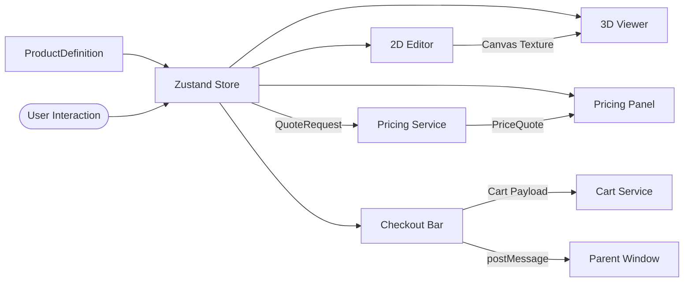

# 10×10 Logo Canopy Tent — Product Configurator

A production-grade 3D product configurator built with **React**, **Three.js (R3F)**, **TypeScript (strict)**, and a data-driven architecture designed to support _any_ configurable product.

---

## 🏗 Architecture

```
src/
├── domain/              # Pure business logic — no React, no I/O
│   ├── schemas/         # Zod schemas → TypeScript types (source of truth)
│   ├── products/        # Product definition data files
│   └── pricing/         # Pure pricing engine + product pricing data
│
├── features/            # Feature-sliced UI modules
│   ├── configurator/    # Zustand store (single source of truth)
│   ├── viewer3d/        # Three.js/R3F 3D viewer
│   ├── editor2d/        # Konva 2D design editor
│   ├── options/         # Product option selectors
│   ├── pricing/         # Live price breakdown panel
│   ├── checkout/        # Add to Cart + Shopify payload inspector
│   └── embed/           # Iframe embed mode + postMessage protocol
│
├── services/            # External integrations (swappable)
│   ├── interfaces/      # Service contracts (PricingService, CartService)
│   ├── mock/            # Demo implementations
│   └── pdf/             # PDF generation (lazy-loaded jsPDF)
│
└── app/                 # Composition root (wires everything together)
```

### Data Flow



### Key Design Decisions

| Decision | Rationale |
|---|---|
| **Data-driven product definition** | Adding a new product = new data file, not new components |
| **Zod schemas as source of truth** | Runtime validation + TypeScript types from one declaration |
| **Material matching by name** | GLB models have inconsistent material index ordering across sizes |
| **`texture.flipY = false`** | Required for glTF UV convention; otherwise texture appears inverted |
| **Pure pricing engine** | Same function runs client-side (tests) and server-side (Vercel function) |
| **HMAC-signed quotes** | Prevents client-side price tampering before cart submission |
| **Normalised coordinates (0–1)** | Design layers work across different canvas/texture resolutions |
| **Module-level services** | Single instances avoid re-creation on React re-renders |

---

## 🚀 Quick Start

```bash
# Install dependencies
npm install

# Start development server
npm run dev

# Type check
npm run typecheck

# Run tests
npm test

# Production build
npm run build
```

The app runs at **http://localhost:3000**.

---

## 📁 Configuration JSON Example

The customer's design state is captured in a `Configuration` object:

```json
{
  "schemaVersion": 1,
  "configurationId": "550e8400-e29b-41d4-a716-446655440000",
  "productId": "canopy-tent-10x10",
  "sizeId": "size-5x5",
  "options": {
    "frame-type": "with-frame",
    "side-walls": "wall-1-single",
    "half-walls": "none"
  },
  "sections": {
    "canopy": {
      "baseColor": "#F5A623",
      "layers": [
        {
          "id": "uuid-here",
          "kind": "text",
          "regionId": "roof-front",
          "normalizedX": 0.5,
          "normalizedY": 0.3,
          "rotationDegrees": 0,
          "scale": 1.2,
          "opacity": 1,
          "zIndex": 0,
          "visible": true,
          "locked": false,
          "content": "ACME CORP",
          "fontFamily": "Arial",
          "fontSizePt": 64,
          "fill": "#FFFFFF",
          "align": "center"
        }
      ]
    }
  }
}
```

---

## 🛒 Shopify Integration Approach

### Variant Mapping

Each option combination maps to a Shopify variant ID via the product definition's `variantMap`:

```
"with-frame:none:none"           → variant 48270445478136
"canopy-only:none:none"          → variant 48270445510904
"with-frame:wall-1-single:none"  → variant 48270445543672
```

### Cart Payload

The configurator builds a Shopify-compatible `/cart/add.js` payload:

```json
{
  "id": "48270445478136",
  "quantity": 1,
  "properties": {
    "Configuration": "with-frame, none, none",
    "Price": "$849.00",
    "_configuration_id": "550e8400-e29b-41d4-a716-446655440000",
    "_quote_id": "uuid",
    "_quote_signature": "hmac-sha256-signature",
    "_preview_url": "/api/configurations/{id}/preview",
    "_production_pdf_url": "/api/configurations/{id}/pdf"
  }
}
```

Properties prefixed with `_` are hidden from the customer at checkout (Shopify convention).

### Iframe Embedding

For deployment on a Shopify store:

```html
<iframe
  src="https://configurator.vercel.app/?embed=1&origin=https://store.myshopify.com"
  sandbox="allow-scripts allow-same-origin"
></iframe>
```

The configurator communicates with the parent via a typed, Zod-validated postMessage protocol:

| Direction | Message Type | Trigger |
|---|---|---|
| Iframe → Parent | `CONFIGURATOR_READY` | On mount |
| Iframe → Parent | `CONFIGURATION_CHANGED` | On any option/design change |
| Iframe → Parent | `ADD_TO_CART_REQUESTED` | User clicks Add to Cart |
| Iframe → Parent | `PRICE_UPDATED` | New price quote computed |
| Parent → Iframe | `SET_OPTION` | Merchant page sets an option |
| Parent → Iframe | `SET_CONFIGURATION` | Load a saved configuration |

---

## 🧪 Testing

```bash
npm test          # Run all tests
npm run test:watch  # Watch mode
```

### Test Coverage (43 Tests, 100% Pass Rate)

| Suite | Tests | What it verifies |
|---|---|---|
| `pricing-engine.test.ts` | 15 | Base price, option deltas, combination bundle overrides, extra artwork surcharges, quantity scaling, currency formatting |
| `schema-validation.test.ts` | 10 | Zod schemas accept valid configurations and reject malformed inputs, disallowed fonts, invalid hex colors, negative quantities |
| `embed-protocol.test.ts` | 12 | Inbound/outbound postMessage schemas, param validation, rejection of malicious/malformed cross-origin payloads |
| `configurator-integration.test.ts` | 6 | End-to-end integration: product init, pricing delta updates, bundle discount resolution, Shopify variant resolution, cart payload generation, 2D layer history undo/redo, JSON export/import round-trip |

---

## 📄 PDF Generation

The configurator generates a production-ready A4 PDF containing:
- Order header with configuration ID and quote ID
- Option selections with labels
- Section specifications with colour swatches
- Line-item price breakdown
- Embedded 3D preview snapshot
- Embedded 2D artwork layout

jsPDF is **lazy-loaded** — it stays out of the initial bundle and is only fetched when the user clicks "Download PDF".

---

## ⚡ Performance

| Optimisation | Impact |
|---|---|
| `frameloop="demand"` | Canvas only re-renders when state changes |
| Manual Vite chunking | Three.js (~800KB) and Konva (~200KB) in separate chunks |
| Debounced pricing | Pricing API requests are debounced by 300ms |
| Stale request cancellation | Only the latest pricing request's response is used |
| Offscreen canvas texture | 2D→3D sync via CanvasTexture without DOM re-flow |
| Image cache (module-level) | Uploaded assets loaded once, reused across renders |

---

## 🔒 Security

| Layer | Implementation |
|---|---|
| **File upload** | Magic-byte validation (PNG/JPEG/WebP headers), not just extension |
| **Font allowlist** | Only pre-approved fonts accepted via Zod enum |
| **Quote integrity** | HMAC-signed quotes prevent client-side price tampering |
| **Embed protocol** | All postMessage payloads validated with Zod schemas |
| **Origin checking** | Embed mode can restrict accepted message origins |
| **Iframe sandbox** | `embed-demo.html` uses `sandbox="allow-scripts allow-same-origin"` |

---

## 🧩 Adding a New Product

To add support for a completely new product (e.g., a table cover):

1. Create a new product definition in `src/domain/products/table-cover.product.ts`
2. Create its pricing data in `src/domain/pricing/table-cover.pricing.ts`
3. Update `App.tsx` to load the new product definition
4. No component changes required

The architecture is **product-agnostic by design** — all UI behaviour derives from the `ProductDefinition` schema.

---

## 📦 Tech Stack

| Library | Version | Purpose |
|---|---|---|
| React | 19.x | UI framework |
| TypeScript | 6.x (strict) | Type safety with `noUncheckedIndexedAccess` |
| Three.js | 0.186 | 3D rendering engine |
| @react-three/fiber | 9.x | React renderer for Three.js |
| @react-three/drei | 10.x | R3F helpers (OrbitControls, Environment, etc.) |
| Zustand + Immer | 5.x | State management with immutable updates |
| Zod | 4.x | Runtime schema validation → TS types |
| Konva + react-konva | 10.x / 19.x | 2D canvas editor |
| jsPDF | 4.x | PDF generation (lazy-loaded) |
| Vite | 8.x | Build tool with HMR |
| Vitest | 5.x | Unit testing |
